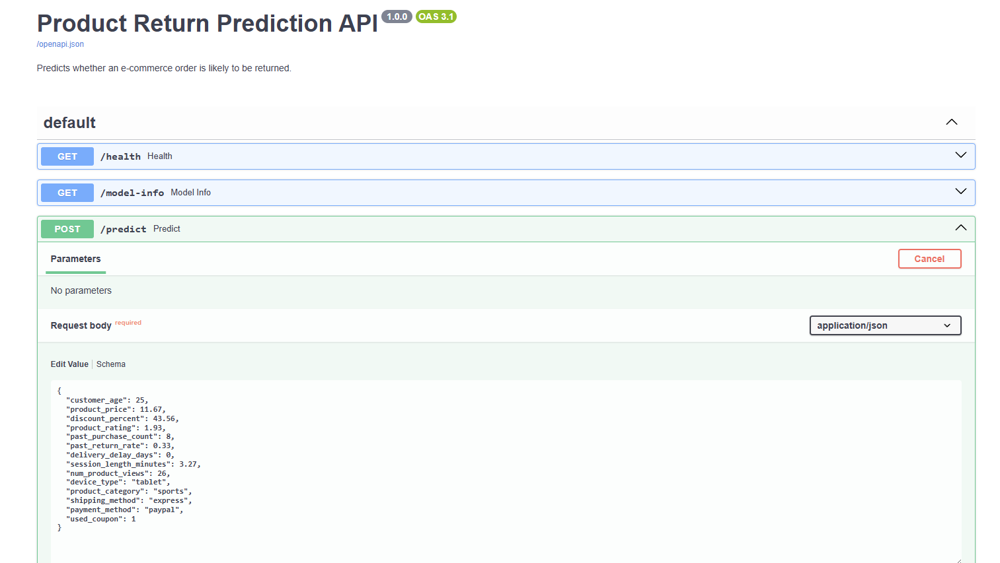
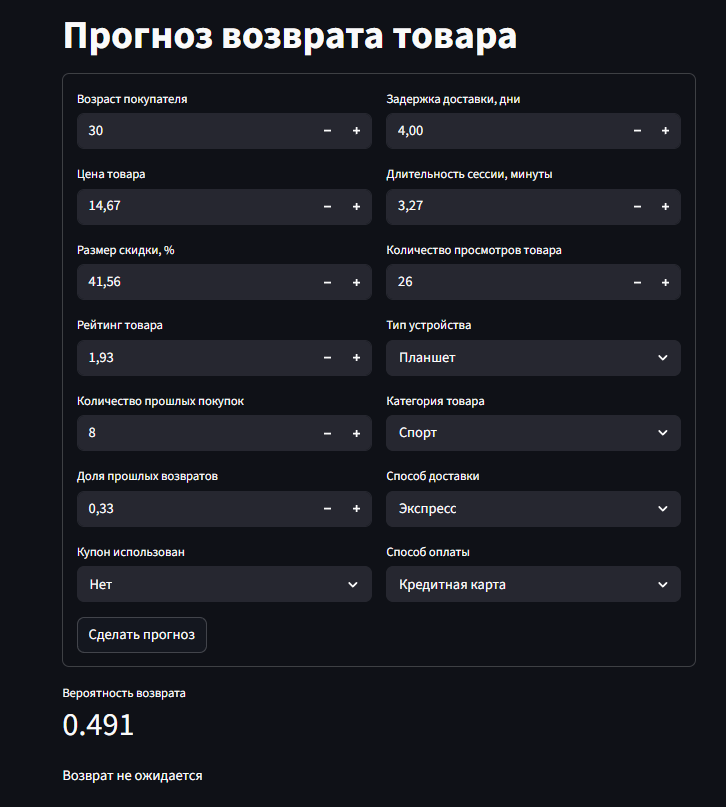

# Отчёт по проекту

**Студент:** Сенчуков Егор Дмитриевич

**Группа:** 237

**Чекпоинт:** CP3


## 1. Введение и постановка задачи

Цель проекта - предсказать, будет ли товар возвращён после покупки. Это задача
бинарной классификации:

- `returned = 0` - товар не вернули;
- `returned = 1` - товар вернули.

Практический смысл для e-commerce простой: если заранее видеть заказы с высоким
риском возврата, можно анализировать проблемные категории, способы доставки,
скидки и ожидать часть финансовых потерь заранее.

Основная метрика - `ROC-AUC`. Я использую её как главную, потому что модель
должна выдавать класс, и ранжировать заказы по вероятности возврата.
Ещё считаю `PR-AUC`, `F1`, `precision`, `recall` и `accuracy`, но
финальную модель выбираю по validation `ROC-AUC`.


## 2. Поиск и описание данных

Источник данных:
https://www.kaggle.com/datasets/hakdevelopment/e-commerce-dataset.

Я выбрал этот датасет, потому что он соответствует теме проекта: в нём
есть признаки клиента, товара и заказа, а целевая переменная показывает факт
возврата.

Используются три файла:

| Файл                    |  Строк | Колонок | Назначение                  |
|-------------------------|-------:|--------:|-----------------------------|
| `train.csv`             | 200000 |      16 | обучение и локальная оценка |
| `test.csv`              |  50000 |      15 | внешний тест без таргета    |
| `sample_submission.csv` |  50000 |       2 | шаблон ответа               |

В `train.csv` есть `14` исходных признаков, `order_id` и таргет `returned`.
Признаки описывают возраст клиента, цену и рейтинг товара, скидку, прошлые
покупки и возвраты, задержку доставки, длительность сессии, просмотры товара,
тип устройства, категорию товара, доставку, оплату и факт использования купона.

Распределение классов:

| Класс          | Количество |   Доля |
|----------------|-----------:|-------:|
| `returned = 0` |     105081 | 52.54% |
| `returned = 1` |      94919 | 47.46% |

Классы достаточно близки по размеру, поэтому сильного дисбаланса нет.


## 3. Обработка и подготовка данных

Preprocessing вынесен в `src/preprocessing.py` и `src/prepare_data.py`.

В данных не было пропусков и полных дублей, но были невалидные значения:

| Проверка                     | Количество строк |
|------------------------------|-----------------:|
| `product_price < 0`          |            27285 |
| `num_product_views < 0`      |            21443 |
| `product_rating < 1`         |            14280 |
| `product_rating > 5`         |             3831 |
| `past_return_rate < 0`       |             2220 |
| `discount_percent < 0`       |             1686 |
| `session_length_minutes < 0` |             1487 |

Я не удалял эти строки, потому что их много. Вместо этого:

- для каждого типа аномалии создаётся флаг `invalid_*`;
- значение клипуется до допустимого диапазона;
- модель получает и исправленное значение, и информацию о том, что оно было
  невалидным.

Feature engineering:

| Признак                 | Смысл                                  |
|-------------------------|----------------------------------------|
| `price_after_discount`  | цена после скидки                      |
| `discount_amount`       | абсолютный размер скидки               |
| `views_per_minute`      | интенсивность просмотра товара         |
| `high_past_return_rate` | высокий исторический процент возвратов |
| `has_discount`          | наличие скидки                         |
| `invalid_*`             | флаги исходных невалидных значений     |

После preprocessing число модельных признаков выросло с `14` до `25`.

EDA сделан в `notebooks/01_eda.ipynb`. В нём построены распределение таргета,
распределения числовых признаков, графики по категориальным признакам, доли
возвратов по категориям и корреляционная матрица.

Для локальной оценки используется stratified split:

- train: `140000` объектов;
- validation: `30000` объектов;
- test: `30000` объектов.

Как избегалась утечка данных:

- `order_id` исключён из признаков;
- imputation, scaling и one-hot encoding обучаются только на train внутри
  `Pipeline`;
- Kaggle `test.csv` без таргета не используется при выборе модели.

## 4. Baseline

Baseline - `logistic_regression_baseline` без feature engineering. Он нужен как
референс, чтобы сравнить CP2-модели с простой моделью.

Validation-результат baseline:

| Модель                         | ROC-AUC | PR-AUC |     F1 | Precision | Recall | Accuracy |
|--------------------------------|--------:|-------:|-------:|----------:|-------:|---------:|
| `logistic_regression_baseline` |  0.5866 | 0.5550 | 0.5499 |    0.5372 | 0.5632 |   0.5624 |

Baseline заметно лучше dummy-классификатора, значит в признаках есть сигнал для
предсказания возврата.


## 5. Эксперименты

В CP2 применялся системный перебор гиперпараметров через
`sklearn.model_selection.ParameterGrid`. Все tuned-модели обучались с feature
engineering, а лучшая модель выбиралась только по validation `ROC-AUC`.

Сетки гиперпараметров:

| Семейство                | Перебираемые параметры                                                             |
|--------------------------|------------------------------------------------------------------------------------|
| `LogisticRegression`     | `C=[0.3, 1.0, 3.0]`, `class_weight=[None, "balanced"]`                             |
| `DecisionTreeClassifier` | `max_depth=[4, 8, 12, None]`, `min_samples_leaf=[50, 200]`                         |
| `RandomForestClassifier` | `n_estimators=[100, 200]`, `max_depth=[8, 12, None]`, `min_samples_leaf=[20, 100]` |
| `ExtraTreesClassifier`   | `n_estimators=[100, 200]`, `max_depth=[8, 12, None]`, `min_samples_leaf=[20, 100]` |

Всего проведено `39` validation-запусков: baseline и `38` конфигураций grid
search. Полная таблица сохранена в `report/cp2_experiments.csv`.

Лучшие validation-результаты по семействам:

| Лучшая модель семейства        | Параметры                                                  | ROC-AUC | PR-AUC |     F1 | Precision | Recall | Accuracy |
|--------------------------------|------------------------------------------------------------|--------:|-------:|-------:|----------:|-------:|---------:|
| `random_forest_grid_08`        | `max_depth=12`, `min_samples_leaf=100`, `n_estimators=200` |  0.5922 | 0.5594 | 0.4705 |    0.5618 | 0.4047 |   0.5677 |
| `logistic_regression_grid_02`  | `C=0.3`, `class_weight="balanced"`                         |  0.5875 | 0.5557 | 0.5500 |    0.5360 | 0.5647 |   0.5614 |
| `extra_trees_grid_05`          | `max_depth=12`, `min_samples_leaf=20`, `n_estimators=100`  |  0.5868 | 0.5535 | 0.4751 |    0.5575 | 0.4139 |   0.5659 |
| `logistic_regression_baseline` | без feature engineering                                    |  0.5866 | 0.5550 | 0.5499 |    0.5372 | 0.5632 |   0.5624 |
| `decision_tree_grid_04`        | `max_depth=8`, `min_samples_leaf=200`                      |  0.5755 | 0.5403 | 0.4900 |    0.5414 | 0.4475 |   0.5579 |

Вывод: лучший результат дал Random Forest с ограниченной глубиной и достаточно
крупным листом. Слишком простое дерево хуже, а Extra Trees не улучшает
Random Forest.


## 6. Финальная модель + интерпретируемость результатов

Финальная модель выбрана по validation `ROC-AUC`:

- модель: `random_forest_grid_08`;
- `max_depth = 12`;
- `min_samples_leaf = 100`;
- `n_estimators = 200`;
- файл: `models/cp2_best_model.joblib`.

Test split использовался один раз после выбора лучшей конфигурации.

Финальная test-оценка:

| ROC-AUC | PR-AUC |     F1 | Precision | Recall | Accuracy |
|--------:|-------:|-------:|----------:|-------:|---------:|
|  0.5922 | 0.5615 | 0.4722 |    0.5644 | 0.4059 |   0.5694 |

Самые важные признаки по `feature_importances_` финального Random Forest:

| Признак                        | Importance |
|--------------------------------|-----------:|
| `used_coupon`                  |     0.0725 |
| `shipping_method_express`      |     0.0660 |
| `delivery_delay_days`          |     0.0637 |
| `discount_amount`              |     0.0531 |
| `product_category_electronics` |     0.0510 |
| `past_return_rate`             |     0.0496 |
| `discount_percent`             |     0.0495 |
| `product_price`                |     0.0491 |

На возврат влияют купон, способ доставки,
задержка доставки, скидка, категория товара, история возвратов и цена.


## 7. Деплой

Для CP3 сделан локальный деплой:

- FastAPI API в `src/api.py`;
- Streamlit UI в `src/streamlit_app.py`;
- Docker Compose сервисы `api` и `ui`.

### API

Запуск:

```bash
uvicorn src.api:app --reload
```

Эндпоинты:

| Метод  | URL           | Назначение                                      |
|--------|---------------|-------------------------------------------------|
| `GET`  | `/health`     | проверка, что сервис работает и модель доступна |
| `GET`  | `/model-info` | информация о модели и ожидаемых признаках       |
| `POST` | `/predict`    | предсказание возврата по признакам заказа       |

Пример тела запроса к `/predict`:

```json
{
  "customer_age": 25,
  "product_price": 11.67,
  "discount_percent": 43.56,
  "product_rating": 1.93,
  "past_purchase_count": 8,
  "past_return_rate": 0.33,
  "delivery_delay_days": 0.0,
  "session_length_minutes": 3.27,
  "num_product_views": 26,
  "device_type": "tablet",
  "product_category": "sports",
  "shipping_method": "express",
  "payment_method": "paypal",
  "used_coupon": 1
}
```

Пример ответа:

```json
{
  "prediction": 1,
  "returned_probability": 0.5766,
  "threshold": 0.5
}
```

### Streamlit

Запуск:

```bash
streamlit run src/streamlit_app.py
```

Интерфейс доступен на `http://localhost:8501`.  Можно ввести признаки
заказа и получить вероятность возврата.

### Docker

```bash
docker compose up api
docker compose up ui
docker compose run --rm checks
```

Модель `models/cp2_best_model.joblib` добавлена в репозиторий, деплой
можно запускать без повторного обучения.

### Скриншоты и видео

- Скриншот Swagger UI: 


  
- Скриншот Streamlit UI:

- Ссылка на видео демонстрации: 


## 8. Заключение и выводы

В работе сделаны: подготовка данных, baseline, эксперименты с
перебором гиперпараметров, финальная модель и локальный деплой через FastAPI и
Streamlit. Лучшей моделью стал Random Forest с test `ROC-AUC = 0.5922`.

Интересно, что на прогноз сильнее всего влияют купон, способ доставки,
задержка доставки, скидка, категория товара, история возвратов и цена.
